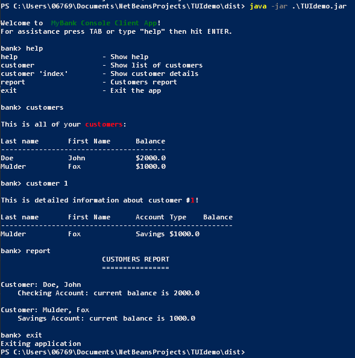

# UI Lab 2 

В ході першої роботи вам пропонується виконати **наступне завдання** - [Робота 2: CLI з jline 3](https://github.com/ppc-ntu-khpi/TUI-Lab2-Starter/blob/master/Lab%202%20-%20CLI/Lab%202.md)

## На "п'ять"
1. Додайте ще одну команду - **report**, яка має виводити звіт за клієнтами такого ж виду, як у роботі номер 8 (див. CustomerReport).
2. Запустіть проект, впевніться, що все працює як очікувалось. Продемонстрируйте результат викладачеві.

